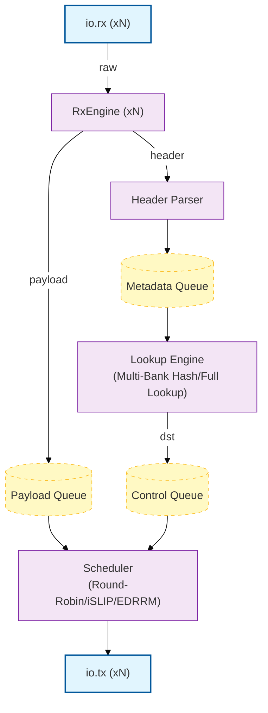

# SPAC-CHISEL

This is a Chisel/Scala replication package for the SPAC network switch paper (arXiv 2604.21881v1). 

This replaces the Python + C++ HLS switch core with a hardware description written in Chisel.

## Status: Milestone 1 - Hardware Core Complete

| Module | Status | Notes |
|--------|--------|-------|
| `Types.scala` - params, bundles | ✅ | `SwitchParams` case class supports all devices axes|
| `RxEngine.scala` - per-port parser FSM | ✅ | 2-state FSM (II=1), basic back-pressure |
| `ForwardTable.scala` - Forwarding Tables | ✅ | FullLookup (II=1); MultiBankHash (II~=3) |
| `Schedulers.scala` - RR, iSLIP, EDRRM | ✅ | RR, iSLIP, EDRRM (RTL + tested) |
| `SwitchTop.scala` - dataflow composition | ✅ | Top level device definition |
| **Tests** - 13 component behaviors & device tests | ✅ | RxEngine -> ForwardTable -> SwitchTop |
| DSE layer (StatSim, DSEEngine, FeatureExtractor) | 🔜 Milestone 2 | |
| Protocol layer (ProtocolSpec, PacketHPPEmitter) | 🔜 Milestone 3 | |

## Architecture



## Dependencies
### Arch
```bash
sudo pacman -S jdk-openjdk sbt git
```
### Debian / Ubuntu
```bash
echo "deb https://repo.scala-sbt.org/scalasbt/debian all main" | sudo tee /etc/apt/sources.list.d/sbt.list
curl -sL "https://keyserver.ubuntu.com/pks/lookup?op=get&search=0x2EE0EA64E40A89B84B2DF73499E82A75642AC823" | sudo gpg --dearmor -o /etc/apt/trusted.gpg.d/sbt.gpg
sudo apt update
sudo apt install -y openjdk-21-jdk git sbt
```

## Building 


```bash
# Build default config
sbt "runMain spac.hw.SwitchTop" 

# Emits generated/SwitchTop.v
```

## Testing


```bash
# Run all tests
sbt test                     

# Run RxEngine suite
sbt "testOnly *RxEngineSpec" 

# Run Scheduler suite's iSLIP tests
sbt "testOnly *SchedulersSpec -- -z iSLIP"            
```

## Generated Verilog

To elaborate other configurations:
```scala
// 8-port MultiBankHash + EDRRM
val p = SwitchParams(nPorts=8, hash=MultiBankHash, sched=EDRRM)
(new ChiselStage).emitVerilog(new SwitchTop(p), Array("--target-dir","generated"))
```

## Key differences from SPAC HLS

|Consideration| SPAC HLS | This repo |
|-|---------|-----------|
| Device Parametrization | Parameterizes device via `constexpr` patching in the C++ codegen DSL | `SwitchParams` case class parameterizes device |
| Design Coverage |EDRRM: Python-only, no Verilog | `EDRRMScheduler` - full Chisel + tests |
| Test Coverage | 402 lines, commented out | Full Component & Device Behavior Tests |
| DSE Framework | `SPAC::Auto` - broken stub | DSE layer coming in Milestone 2 |
| Vitis HLS + Alveo U45N required | Standard Verilog (via `sbt`) |

## Spec reference
See `SPAC_chisel_spec.md` for a full implementation specification.
