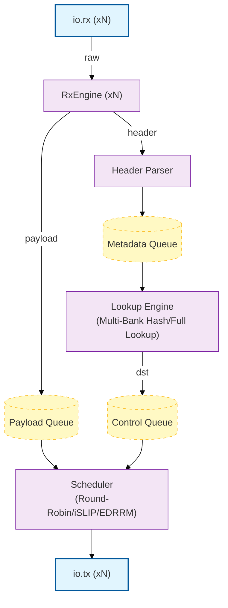

# SPAC-CHISEL

Chisel/Scala replication of the SPAC network switch paper (arXiv 2604.21881v1). Replaces the Python + C++ HLS switch core with a hardware description in Chisel 7.

## Status: Milestone 1 - Hardware Core Complete

| Module | Status | Notes |
|--------|--------|-------|
| `Types.scala` — params, bundles | ✅ | `SwitchParams` case class supports all device axes |
| `RxEngine.scala` — per-port parser FSM | ✅ | 2-state FSM (II=1), basic back-pressure |
| `ForwardTable.scala` — Forwarding Tables | ✅ | FullLookup (II=1); MultiBankHash (II≈3) |
| `Schedulers.scala` — RR, iSLIP, EDRRM | ✅ | RR, iSLIP, EDRRM (RTL + tested) |
| `SwitchTop.scala` — dataflow composition | ✅ | Top level device definition |
| **Tests** — 12 component & device tests | ✅ | RxEngine → ForwardTable → SwitchTop |
| DSE layer (StatSim, DSEEngine, FeatureExtractor) | 🔜 Milestone 2 | |
| Protocol layer (ProtocolSpec, PacketHPPEmitter) | 🔜 Milestone 3 | |

## Architecture



## Dependencies

### Scala CLI

Install [Scala CLI](https://scala-cli.virtuslab.org/install)

```bash
# Linux
curl -sSLf https://scala-cli.virtuslab.org/get | sh

# OSX
brew install Virtuslab/scala-cli/scala-cli

# Windows
scoop install scala-cli
```

## Building

```bash
scala-cli build .
# [SPAC] => SystemVerilog emitted to generated/
```

## Testing

```bash
# Run tests
scala-cli test .

# Run a suite
scala-cli test . --test-only spac.hw.RxEngineTest
scala-cli test . --test-only spac.hw.SwitchTopTest

# Run tests matching a name pattern
scala-cli test . --test-only spac.hw.SwitchTopTest -- -z iSLIP
scala-cli test . --test-only spac.hw.SwitchTopTest -- -z EDRRM
```

## Generated SystemVerilog

To elaborate other configurations:
```scala
// In a scratch file or src/main/scala/spac/hw/Elaborate.scala
import spac.hw._
import _root_.circt.stage.ChiselStage

val params = SwitchParams(nPorts=8, hash=MultiBankHash, sched=EDRRM)
ChiselStage.emitSystemVerilogFile(
  gen  = new SwitchTop(params),
  args = Array("--target-dir", "generated"),
)
```

See `SPAC_chisel_spec.md` for a full implementation specification.
