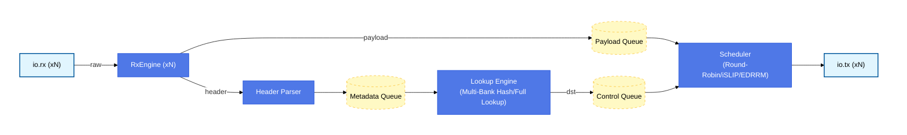

# SPAC-CHISEL

Chisel/Scala replication of the SPAC network switch paper (arXiv 2604.21881v1). Replaces the Python + C++ HLS switch core with a hardware description in Chisel 7.

## Architecture



## Dependencies

### Scala CLI

Install [Scala CLI](https://scala-cli.virtuslab.org/install)

```bash
# Linux
curl -fL https://github.com/Virtuslab/scala-cli/releases/latest/download/scala-cli-x86_64-pc-linux.gz | gzip -d > scala-cli
chmod +x scala-cli
mv scala-cli /home/$USER/.local/bin/scala-cli

# OSX
brew install Virtuslab/scala-cli/scala-cli

# Windows
scoop install scala-cli
```

### Verilator

```bash
# Arch
sudo pacman -S verilator

# Ubuntu/Debian
sudo apt install verilator

# OSX
brew install verilator

# Windows - Via WSL 2 Ubuntu
sudo apt install verilator 

```

## Building

```bash
scala-cli build .
# [SPAC] => SystemVerilog emitted to generated/
```

## Testing

```bash
# Run tests
scala-cli test .

# Run a suite
scala-cli test . --test-only spac.hw.RxEngineTest
scala-cli test . --test-only spac.hw.SwitchTopTest

# Run tests matching a name pattern
scala-cli test . --test-only spac.hw.SwitchTopTest -- -z iSLIP
scala-cli test . --test-only spac.hw.SwitchTopTest -- -z EDRRM
```

## Generated SystemVerilog

To elaborate other configurations:
```scala
// In a scratch file or src/main/scala/spac/hw/Elaborate.scala
import spac.hw._
import _root_.circt.stage.ChiselStage

val params = SwitchParams(nPorts=8, hash=MultiBankHash, sched=EDRRM)
ChiselStage.emitSystemVerilogFile(
  gen  = new SwitchTop(params),
  args = Array("--target-dir", "generated"),
)
```
